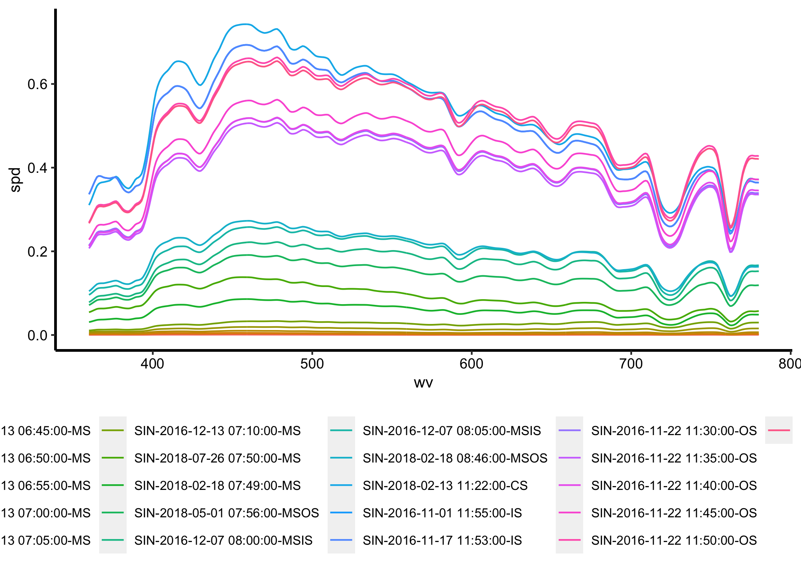

Comparing spectral skies
================
Priji Balakrishnan
3/12/2020

We load the following libraries for our analysis.

``` r
library(tidyverse)
library(lubridate)
library(here)
```

We load the
data.

``` r
singapore_skies <- readRDS(here::here("resources/processed_data/singapore.rds"))
berlin_skies <- readRDS(here::here("resources/processed_data/berlin.rds"))

spectral_skies <- singapore_skies %>%
  bind_rows(berlin_skies) %>%
  arrange(loc, hour(datetime), SkyType, wv) %>%
  mutate(measurement = as_factor(str_c(loc, as.character(datetime), SkyType, sep="-")))
```

    ## Warning in bind_rows_(x, .id): binding factor and character vector, coercing
    ## into character vector

    ## Warning in bind_rows_(x, .id): binding character and factor vector, coercing
    ## into character vector

All
    experiments:

``` r
levels(spectral_skies$measurement)
```

    ##  [1] "BER-2019-02-25 09:07:00-CS"   "BER-2019-02-25 12:00:00-CS"  
    ##  [3] "BER-2019-02-25 15:00:00-CS"   "SIN-2016-12-13 06:45:00-MS"  
    ##  [5] "SIN-2016-12-13 06:50:00-MS"   "SIN-2016-12-13 06:55:00-MS"  
    ##  [7] "SIN-2016-12-13 07:00:00-MS"   "SIN-2016-12-13 07:05:00-MS"  
    ##  [9] "SIN-2016-12-13 07:10:00-MS"   "SIN-2018-07-26 07:50:00-MS"  
    ## [11] "SIN-2018-02-18 07:49:00-MS"   "SIN-2018-05-01 07:56:00-MSOS"
    ## [13] "SIN-2016-12-07 08:00:00-MSIS" "SIN-2016-12-07 08:05:00-MSIS"
    ## [15] "SIN-2018-02-18 08:46:00-MSOS" "SIN-2018-02-13 11:22:00-CS"  
    ## [17] "SIN-2016-11-01 11:55:00-IS"   "SIN-2016-11-17 11:53:00-IS"  
    ## [19] "SIN-2016-11-22 11:30:00-OS"   "SIN-2016-11-22 11:35:00-OS"  
    ## [21] "SIN-2016-11-22 11:40:00-OS"   "SIN-2016-11-22 11:45:00-OS"  
    ## [23] "SIN-2016-11-22 11:50:00-OS"   "SIN-2016-11-22 11:55:00-OS"  
    ## [25] "SIN-2018-05-24 12:39:00-CS"   "SIN-2016-11-22 12:00:00-OS"  
    ## [27] "SIN-2016-11-18 13:20:00-IS"   "SIN-2016-11-18 13:25:00-IS"  
    ## [29] "SIN-2016-11-18 13:30:00-IS"   "SIN-2016-11-18 13:35:00-IS"  
    ## [31] "SIN-2016-11-18 13:40:00-IS"   "SIN-2016-11-18 13:50:00-IS"  
    ## [33] "SIN-2016-11-18 13:55:00-IS"   "SIN-2018-05-28 13:24:00-OS"  
    ## [35] "SIN-2016-11-18 14:00:00-IS"   "SIN-2018-07-21 14:01:00-OS"  
    ## [37] "SIN-2018-07-28 15:11:00-CS"   "SIN-2016-11-21 16:20:00-IS"  
    ## [39] "SIN-2016-11-21 16:25:00-IS"   "SIN-2016-11-21 16:30:00-IS"  
    ## [41] "SIN-2018-07-25 18:46:00-ES"   "SIN-2018-08-11 18:45:00-ES"  
    ## [43] "SIN-2018-02-18 18:42:00-ES"   "SIN-2017-04-06 18:07:00-ES"  
    ## [45] "SIN-2016-12-16 19:15:00-ESCS" "SIN-2016-12-16 19:00:00-ESCS"
    ## [47] "SIN-2016-12-16 19:10:00-ESCS"

The following notebook expects data according to the following schema:

  - `wv`
  - `spd`
  - `SkyType`
  - `CCT`
  - `loc`
  - `datetime`: date format

## Comparison between different Singapore morning skies

We subset the data to get measurements in Singapore during the morning.

``` r
singapore_morning <- spectral_skies %>%
  filter(loc == "SIN", hour(datetime) <= 11)
```

``` r
singapore_morning %>%
  ggplot() +
  geom_line(aes(x = wv, y = spd, group = measurement, color = measurement))
```

<!-- -->

## Comparison between Singapore and Berlin

``` r
mornings <- spectral_skies %>%
  filter(SkyType == "CS" | str_starts(SkyType, "MS"), hour(datetime) >= 7, hour(datetime) <= 10,
         loc == "BER" | (loc == "SIN" & month(datetime) == 2))
```

``` r
mornings <- spectral_skies %>%
  filter(hour(datetime) >= 7, hour(datetime) <= 10,
         loc == "BER" | (loc == "SIN" & month(datetime) == 2))
```

``` r
mornings %>%
  ggplot() +
  geom_line(aes(x = wv, y = spd, group = measurement, color = measurement))
```

<!-- -->

``` r
mornings %>%
  filter(wv == 560) %>%
  select(wv, measurement, spd) %>%
  inner_join(mornings, by = c("measurement")) %>%
  mutate(normalised_spd = spd.y / spd.x) %>%
  select(-wv.x, -spd.x, wv = wv.y, spd = spd.y) %>%
  ggplot() +
  geom_line(aes(x = wv, y = normalised_spd, group = measurement, color = measurement)) +
  geom_vline(xintercept = 725, linetype = 3, size = 0.2)+
  annotate(geom = "text", x = 725, y = 1.2, label = "Water vapour  725nm", 
           color = "black", angle = 90, size = 2.7, hjust = 1, vjust = -0.4)
```

<!-- -->
