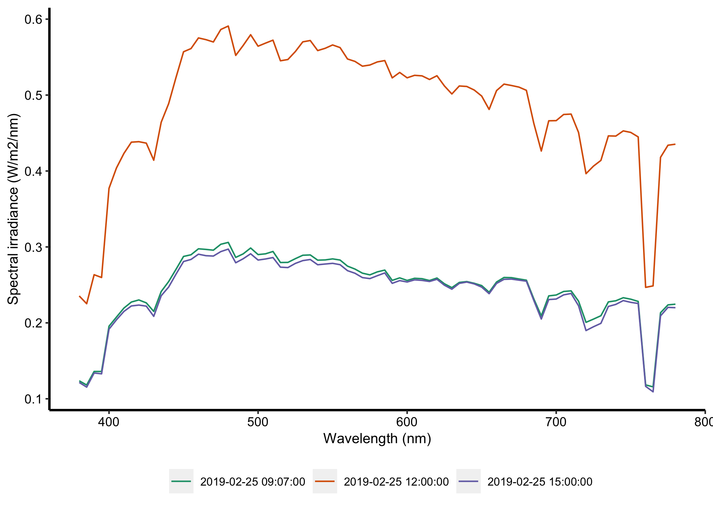

Processing Berlin data
================
Priji Balakrishnan
3/12/2020

Load libraries

``` r
library(tidyverse)
library(lubridate)
library(here)
```

### Load data

``` r
a <- read_csv(here::here("resources/berlin/25feb19-0907-CS-5826K.csv")) %>%
  mutate(loc = "BER",
         datetime = ymd_hms("2019-02-25 09:07:00"),
         SkyType = "CS",
         CCT = 5826)
b <- read_csv(here::here("resources/berlin/25feb19-1200-CS-5607K.csv")) %>%
  mutate(loc = "BER",
         datetime = ymd_hms("2019-02-25 12:00:00"),
         SkyType = "CS",
         CCT = 5607)
c <- read_csv(here::here("resources/berlin/25feb19-1500-CS-5753K.csv")) %>%
  mutate(loc = "BER",
         datetime = ymd_hms("2019-02-25 15:00:00"),
         SkyType = "CS",
         CCT = 5753)

berlin_skies <- a %>%
  bind_rows(b) %>%
  bind_rows(c)
```

Save the data as an RDS object.

``` r
saveRDS(berlin_skies, here::here("resources/processed_data/berlin.rds"))
```

### Explore data

``` r
berlin_skies %>% glimpse()
```

    ## Observations: 243
    ## Variables: 6
    ## $ wv       <dbl> 380, 385, 390, 395, 400, 405, 410, 415, 420, 425, 430, 435, …
    ## $ spd      <dbl> 0.123692, 0.118156, 0.135983, 0.135993, 0.195651, 0.207620, …
    ## $ loc      <chr> "BER", "BER", "BER", "BER", "BER", "BER", "BER", "BER", "BER…
    ## $ datetime <dttm> 2019-02-25 09:07:00, 2019-02-25 09:07:00, 2019-02-25 09:07:…
    ## $ SkyType  <chr> "CS", "CS", "CS", "CS", "CS", "CS", "CS", "CS", "CS", "CS", …
    ## $ CCT      <dbl> 5826, 5826, 5826, 5826, 5826, 5826, 5826, 5826, 5826, 5826, …

Description of the variables:

  - **wv**: Wavelength in nm (nanometers)
  - **spd**: Spectral irradiance measured in W/m<sup>2</sup>/nm
  - **loc**: Location code for Berlin
  - **datetime**: Date and time of measurement taken in YY-MM-DD
    HH:MM:SS
  - **SkyType**: Sky condition code–Clear Sky (CS)
  - **CCT**: Colour temperature of the measured sky in Kelvin (K)

The measurements were taken at three different times of the day–morning
(9am), noon (12pm), and evening (3pm).

``` r
berlin_skies %>% 
  select(datetime) %>%
  distinct()
```

    ## # A tibble: 3 x 1
    ##   datetime           
    ##   <dttm>             
    ## 1 2019-02-25 09:07:00
    ## 2 2019-02-25 12:00:00
    ## 3 2019-02-25 15:00:00

``` r
berlin_skies %>%
  mutate(datetime = as.character(datetime)) %>%
  ggplot() +
  geom_line(aes(x = wv, y = spd, group = datetime, colour = datetime)) +
  scale_color_brewer(palette = "Dark2") +
  xlab("Wavelength (nm)") +
  ylab("Spectral irradiance (W/m2/nm)")
```

<!-- -->
